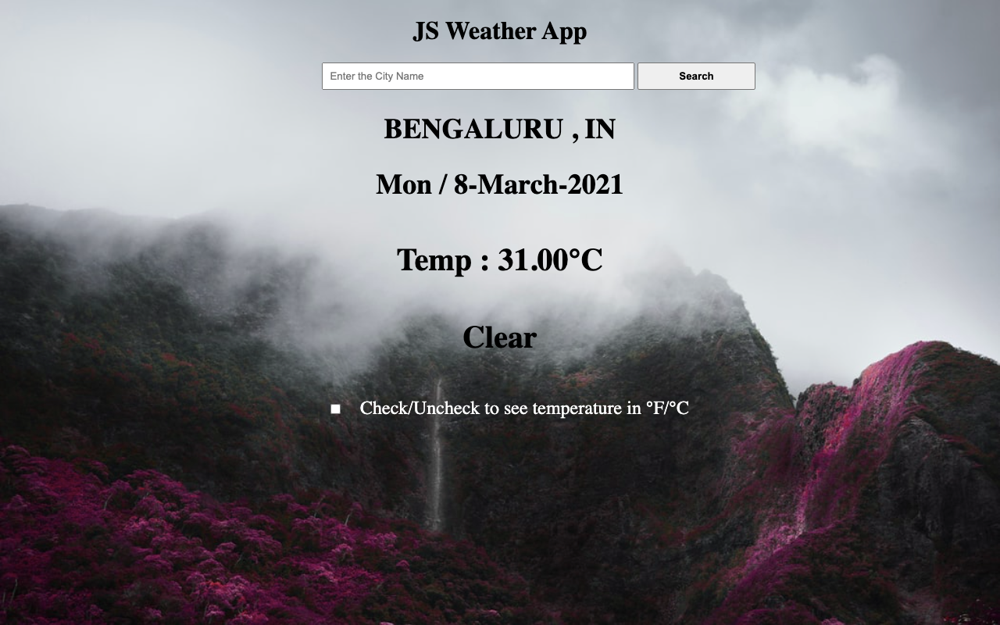

# JS-Weather-app

> The website is built with JavaScript, webpack and weather API. This is a weather app that allows user to search for a specific location weather and toggle displaying the data in Fahrenheit or Celsius.

Additional description about the project and its features.

## Built With

- Javascript
- Bootstrap
- HTML & CSS
- webpack

## Live Demo

[Live Demo Link](https://cranky-haibt-9f7f48.netlify.app/)

## Getting Started

To get a local copy up and running follow these simple example steps.

1. To clone the following repository, run - git clone https://github.com/jrai0792/JS-Weather-app
2. Run cd JS-Weather-app
3. Run npm install.

## Authors

👤 **Jyoti Rai**

- GitHub: [@JyotiRai](https://github.com/jrai0792)
- Twitter: [@JyotiRai](https://twitter.com/jyotirai0792)
- LinkedIn: [JyotiRai](https://linkedin.com/rai-jyoti)

## Show your support

Give a ⭐️ if you like this project!

## 📝 License

This project is [MIT](lic.url) licensed.
